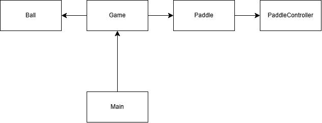

# Pong Game 🎮

A classic Pong game implemented in C++ using modern libraries like **threepp** for rendering and **Catch2** for unit testing. 
This project is a fun and straightforward recreation of the iconic two-player arcade game

---

## Features
- **Two-player mode**: Challenge a friend in a local multiplayer match.
- **Collision logic**: Realistic ball bounces off paddles and walls.
- **Score tracking**: Tracks and displays scores for both players.
- **Game restart**: Automatically resets the game after a score.
- **Simple controls**: Intuitive keyboard-based paddle movement.

---

## How to Play
1. **Start the game**:
   - Press the `B` key to begin the match.
2. **Player controls**:
   - **Player 1** (Left Paddle):
      - Move up: `W`
      - Move down: `S`
   - **Player 2** (Right Paddle):
      - Move up: `O`
      - Move down: `L`
3. **Objective**:
   - Prevent the ball from passing your paddle.
   - Earn points by making the ball pass your opponent's paddle.

---

## UML Diagram

This is the UML diagram for the project structure:

